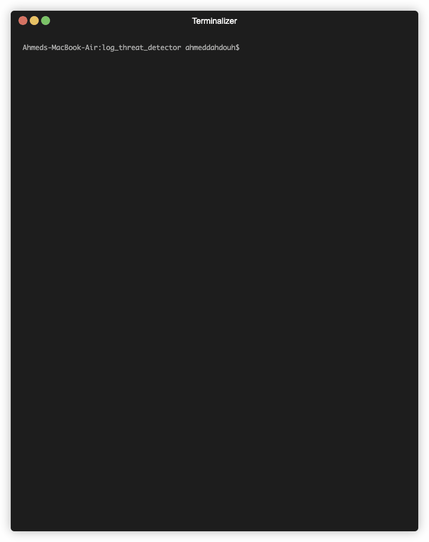
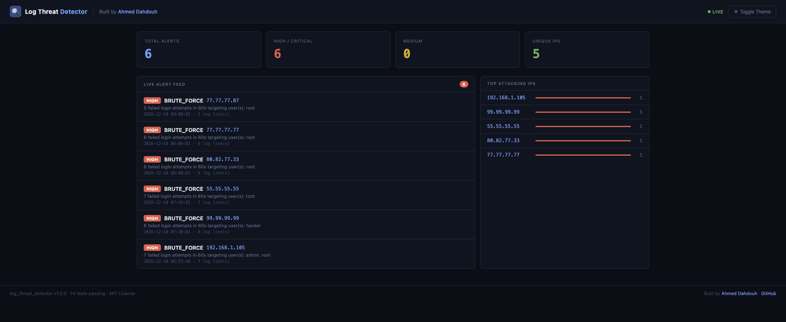
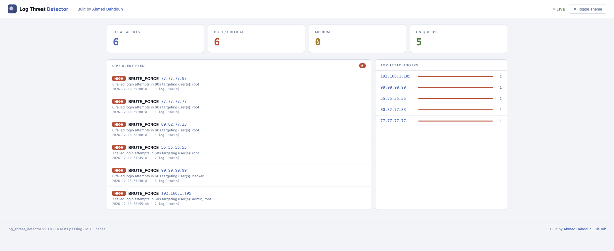

# 🔍 Log Threat Detector


A SIEM-style threat detection CLI that parses SSH, Apache, and syslog files to detect brute-force attacks, port scans, and suspicious activity — with real-time monitoring, email alerting, a correlation engine that connects multi-vector attacks, and live threat intelligence via AbuseIPDB.

---

## Architecture



> Log files → Parsers → Detection engines → Correlation engine → Threat intelligence → Alert output + JSON report

---

## Demo



---
## Web Dashboard

Run with `--dashboard` flag to launch the live web interface:

```bash
python3 main.py --watch logs/ssh.log --dashboard
```

Then open http://localhost:5000 in your browser.




---
## Features

| Detection | Log Source | Severity |
|---|---|---|
| Brute force login attempts | SSH logs | HIGH |
| Port scan detection | Syslog (UFW/iptables) | HIGH |
| Suspicious user agents | Apache logs | MEDIUM |
| Anomaly / high request rate | Apache logs | MEDIUM |
| Multi-vector correlation engine | All sources | CRITICAL |
| AbuseIPDB threat intelligence | All alerts | — |
| Real-time monitoring (`--watch`) | Any supported log | — |
| Email alerting | Watch mode (HIGH/CRITICAL) | — |

---

## How the Correlation Engine Works

Most log parsers fire independent alerts. This tool goes further — it groups alerts by source IP across all log sources and detects coordinated attack patterns:

| Pattern | Alert Type | Triggers When |
|---|---|---|
| Port scan + suspicious user agent | `RECONNAISSANCE` | Same IP probes ports and uses attack tools |
| Brute force + port scan | `COORDINATED_ATTACK` | Same IP scans and attempts login |
| Brute force + suspicious user agent | `TARGETED_ATTACK` | Same IP uses tools and forces login |
| All three | `FULL_COMPROMISE_ATTEMPT` | Same IP triggers every attack vector |

When a pattern is matched, all contributing alerts are merged into a single `CRITICAL` alert with combined evidence — exactly how commercial SIEM tools like Splunk operate.

---

## Threat Intelligence

Every alert is automatically enriched with live threat intelligence from AbuseIPDB. Known malicious IPs are flagged instantly:

```
[HIGH] BRUTE_FORCE — 80.82.77.33
  6 failed login attempts in 60s targeting user(s): root
  🌐 Threat Intel: KNOWN MALICIOUS (abuse score: 100% | reports: 8209 | country: NL | ISP: FiberXpress BV)
```

Configure in `config.py`:

```python
"threat_intel": {
    "enabled": True,
    "abuseipdb_api_key": "YOUR_API_KEY_HERE",
    "min_abuse_score": 50,
    "cache_ttl_seconds": 3600,
}
```

> Get a free API key at https://www.abuseipdb.com — 1000 lookups/day on the free tier. Never commit your API key to the repo.

---

## Project Structure

```
log_threat_detector/
├── main.py                    # CLI entry point
├── config.py                  # Central thresholds and settings
├── Makefile                   # Shortcuts for common commands
├── parser/
│   ├── base.py                # Shared LogEntry data model
│   ├── ssh_parser.py          # OpenSSH log parser
│   ├── apache_parser.py       # Apache Combined Log Format parser
│   └── syslog_parser.py       # UFW/iptables syslog parser
├── detection/
│   ├── base.py                # Shared Alert data model
│   ├── brute_force.py         # Brute force detection (sliding window)
│   ├── port_scan.py           # Port scan detection (sliding window)
│   ├── user_agent.py          # Suspicious user agent detection
│   ├── anomaly.py             # High request rate anomaly detection
│   ├── correlation.py         # Multi-vector attack correlation engine
│   ├── watch_mode.py          # Real-time log tailing engine
│   └── threat_intel.py        # AbuseIPDB threat intelligence integration
├── output/
│   ├── alert_output.py        # Colored terminal output with severity filter
│   ├── json_report.py         # JSON report generator
│   └── email_alert.py         # Email notifications for HIGH/CRITICAL alerts
├── logs/                      # Sample log files
├── tests/                     # Unit tests (14 tests)
└── requirements.txt
```

---

## Installation

```bash
git clone https://github.com/AhmedDAH1/log_threat_detector.git
cd log_threat_detector
pip install -r requirements.txt
```

---

## Usage

```bash
# Run all detections on all default log files
python3 main.py --all

# Show only HIGH and CRITICAL alerts
python3 main.py --all --severity HIGH

# Run only brute force detection on a specific SSH log
python3 main.py --ssh logs/ssh.log --brute-force

# Run user agent and anomaly detection on Apache logs
python3 main.py --apache logs/apache.log --user-agent --anomaly

# Run port scan detection and save a custom report
python3 main.py --syslog logs/syslog.log --port-scan --report output/report.json

# Watch a log file in real time for live threat detection
python3 main.py --watch logs/ssh.log
```

---

## CLI Options

```
Log file inputs:
  --ssh FILE        Path to SSH log file
  --apache FILE     Path to Apache log file
  --syslog FILE     Path to syslog file

Detection modules:
  --brute-force     Detect brute force login attempts
  --user-agent      Detect suspicious user agents
  --anomaly         Detect high request rate anomalies
  --port-scan       Detect port scan attempts
  --all             Run all detections on all default log files

Live monitoring:
  --watch FILE      Tail a log file in real time and detect threats as they appear

Output options:
  --severity LEVEL  Minimum severity: LOW | MEDIUM | HIGH | CRITICAL (default: LOW)
  --report [FILE]   Save JSON report (default: output/report.json)
```

---

## Makefile

```bash
make run      # run all detections on default log files
make test     # run all 14 unit tests
make watch    # start live monitoring on ssh log
make clean    # remove cache and generated reports
```

---

## Email Alerting

When running in `--watch` mode, the tool sends email notifications for HIGH and CRITICAL alerts. Configure in `config.py`:

```python
"email": {
    "enabled": True,
    "smtp_host": "smtp.gmail.com",
    "smtp_port": 587,
    "sender_email": "your_gmail@gmail.com",
    "sender_password": "your_app_password",
    "recipient_email": "alerts@yourdomain.com",
}
```

> **Note:** Use a Gmail App Password — not your regular password. Generate one at https://myaccount.google.com/apppasswords. Never commit credentials to the repo.

---

## Sample Output

```
🔍 Log Threat Detector — Starting Analysis

── SSH: logs/ssh.log (28 entries) ───────────────
  [HIGH] BRUTE_FORCE — 80.82.77.33
    6 failed login attempts in 60s targeting user(s): root
    First seen : 2026-12-10 08:00:01
    Evidence   : 6 log line(s)
    🌐 Threat Intel: KNOWN MALICIOUS (abuse score: 100% | reports: 8209 | country: NL | ISP: FiberXpress BV)

── Apache: logs/apache.log (11 entries) ─────────
  [MEDIUM] SUSPICIOUS_USER_AGENT — 45.33.32.156
    Malicious tool detected in User-Agent: 'nikto'

── Syslog: logs/syslog.log (13 entries) ─────────
  [HIGH] PORT_SCAN — 45.33.32.156
    11 unique ports probed in 10s: [22, 25, 80, 443, 3306, ...]

── Correlation Engine ────────────────────────────
  [CRITICAL] RECONNAISSANCE — 45.33.32.156
    Same IP performed port scanning and used a known attack tool.
    Contributing alerts: SUSPICIOUS_USER_AGENT (MEDIUM), PORT_SCAN (HIGH)
    First seen : 2026-12-10 07:10:00
    Evidence   : 12 log line(s)

========== SUMMARY ==========
  Total alerts : 9
  High/Critical: 6
  Medium       : 3
  Low          : 0
==============================
```

---

## Configuration

All thresholds live in `config.py` — adjust without touching detection logic:

```python
CONFIG = {
    "brute_force": {
        "max_failed_attempts": 5,
        "time_window_seconds": 60,
    },
    "port_scan": {
        "max_ports": 10,
        "time_window_seconds": 10,
    },
    "anomaly": {
        "request_rate_per_minute": 100,
    },
    "threat_intel": {
        "enabled": True,
        "abuseipdb_api_key": "YOUR_API_KEY_HERE",
        "min_abuse_score": 50,
        "cache_ttl_seconds": 3600,
    },
}
```

---

## Tech Stack

- **Language**: Python 3.10+
- **Libraries**: `colorama` for terminal output
- **External API**: AbuseIPDB for live threat intelligence
- **Architecture**: Modular — parsers, detectors, and output fully decoupled
- **CI**: GitHub Actions — 14 tests run automatically on every push

---

## Author

Ahmed Dahdouh — [GitHub](https://github.com/AhmedDAH1)
